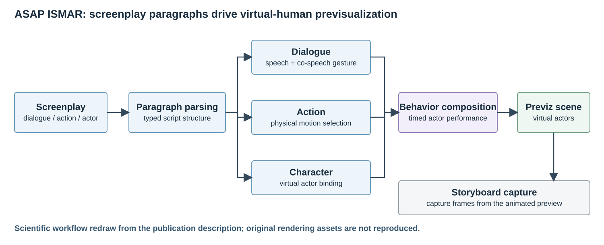

# ASAP: Auto-generating Storyboard And Previz with Virtual Humans

**Hanseob Kim, Ghazanfar Ali, Jae-In Hwang**

**IEEE ISMAR-Adjunct · 2021** · Published

[Paper / publisher](https://doi.org/10.1109/ismar-adjunct54149.2021.00071) · [Project page](https://ghazanfarali.com/research/asap-ismar/) · [BibTeX](citation.bib) · [Requirements](REQUIREMENTS.md) · [Code & setup](#implementation-and-usage)

> An early ASAP tool turns script structure into animated previews.



*New scientific workflow schematic for the early ISMAR paper, based on its available publication description. This is not a figure extracted from the later ASAP journal article.*

## Why this research

Screenwriters benefit from seeing their story before production, but manual previsualization is costly. The early ASAP tool uses screenplay paragraphs to drive virtual-human scenes and storyboard capture.

The ISMAR paper presents a screenplay-driven tool for screenwriters and filmmakers. It parses character, dialogue, and action paragraphs and combines behavior-generation methods to animate virtual humans; users can capture played scenes into a storyboard.

## Method at a glance

**Final Draft screenplay** → **Paragraph parsing + behavior** → **Previz + storyboard**

| | Research system |
|---|---|
| Input | A screenplay in Final Draft format |
| Method | Screenplay parsing with learned, data-driven, and rule-based behavior modules |
| Output | Previsualized virtual-human animation and captured storyboards |

## Evidence and scope

Tool and workflow demonstration

**Attribution:** These findings describe the paper or manuscript, not results obtained with this repository's code.

**Study context:** System scenarios in the ISMAR paper.

**Limitations:** The 2024-online journal is a later extension. Its multi-output benchmarks are not results of this 2021 paper.

## Explore the implementation

A standalone script-to-previz and storyboard variant. Only the early paper's abstract was accessible; the later journal informs disclosed shared-architecture choices.

This repository contains independently written research code. The institute's original source, datasets and trained models are not distributed. Public-data preparation, commands, assumptions and checks are documented below and in [REQUIREMENTS.md](REQUIREMENTS.md).

## Resources and citation

Read the paper through its [publisher record](https://doi.org/10.1109/ismar-adjunct54149.2021.00071). PDFs are hosted by publishers or preprint archives rather than stored in this repository.

Please cite the research paper when using its ideas; [download the BibTeX citation](citation.bib). The implementation has its own documented scope.

## Implementation and usage

<!-- implementation-guide -->

This standalone project converts Final Draft `.fdx` or structured screenplay text into a portable schematic previz and a storyboard captured from its significant playback events. It focuses on the early system described in the ISMAR adjunct paper.

**Citation.** Hanseob Kim, Ghazanfar Ali, and Jae-In Hwang. “ASAP: Auto-generating Storyboard And Previz with Virtual Humans.” *2021 IEEE International Symposium on Mixed and Augmented Reality Adjunct (ISMAR-Adjunct)*, pp. 316–320 (2021). [https://doi.org/10.1109/ISMAR-Adjunct54149.2021.00071](https://doi.org/10.1109/ISMAR-Adjunct54149.2021.00071). Status: published.

Only the abstract and public metadata were available locally for this variant. The later ASAP journal paper supplies shared-architecture context; [REQUIREMENTS.md](REQUIREMENTS.md) marks that boundary. This is not institute code and includes no paper data, models, assets, or weights.

### Run the included example

```powershell
python -m venv .venv
.venv\Scripts\Activate.ps1
python -m pip install -e .
python scripts/smoke.py
start outputs/smoke/storyboard.html
start outputs/smoke/previz.html
```

The default backend is a deterministic TF-IDF cosine baseline. For cache-only semantic matching, install `python -m pip install -e ".[semantic]"` and add `"resolver": {"backend": "sentence-transformer", "model": "path-or-cached-model-name"}` to the library. The loader sets `local_files_only=True` and never downloads weights.

### Input schemas

Structured text uses one `LABEL: text` record per line. Supported labels are `SCENE`, `ACTION`, `CHARACTER`, `DIALOGUE`, and `PARENTHETICAL`. FDX input reads `Paragraph Type` plus nested `Text` elements. The library JSON contains `stage`, keyed `characters`, keyed `props` with interaction anchors, and `motions` whose entries include `id`, `kind`, and example `phrases`.

`timeline.json` is the canonical output. The self-contained HTML files are schematic planning artifacts and do not reproduce Unity rendering, trained gesture models, motion capture, commercial speech/lip-sync, or 3D assets.

### Public data and model setup

The included screenplay and motion library are authored artificial fixtures, not paper data. Use screenplays you own or public-domain scripts. Keep user downloads under ignored asset/data/model directories.

To swap in real inputs, keep the same labels in the screenplay (or use an `.fdx` file) and the same keys in `library.json`, then run `asap-ismar path/to/screenplay.fdx --library path/to/library.json --out outputs/my-run`. The smoke script and CLI call the same parser, compiler, and renderer.

See [REQUIREMENTS.md](REQUIREMENTS.md) for paper facts, implementation assumptions, and scope limits.
